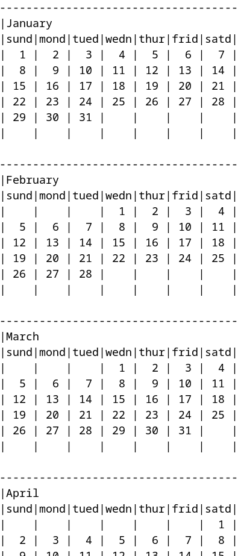

# TCalendar

## Description

This project is a C++ program that generates a calendar for a given year and displays it on the terminal.

## Features

* Calculates the calendar for any valid year.
* Presents dates and months in a clear and readable format.
* Simple and efficient C++ implementation.

## Demo

Example of the generated calendar: 

## Usage

Clone this repository:
```bash
git clone https://github.com/your-username/cpp-calendar-generator.git
```

Navigate to the project directory:
```bash
cd cpp-calendar-generator
```

Compile the program:
```bash
g++ calendar.cpp -o calendar
```

Run the program with a year as input:
```bash
./calendar <year>
```

## Example

```bash
./calendar 2023
```

## Output

(The program will display the complete calendar for the year 2023)

## Contributing

Pull requests are welcome. For major changes, please open an issue first to discuss what you would like to change.

## License

MIT: https://choosealicense.com/licenses/mit/: https://choosealicense.com/licenses/mit/

## Contact

Feel free to contact me for any questions or suggestions.

## Additional Information

* Programming language: C++
* Required libraries: None
* Supported platforms: Any platform with a C++ compiler